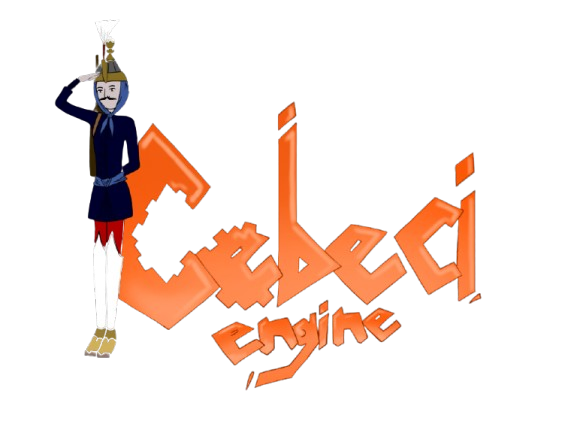

  

## Cebeci Engine

**Cebeci Engine** is a minimalist, modular C++ core framework built around the **KISS (Keep It Simple, Stupid)** philosophy. Rather than forcing developers into a rigid, monolithic game engine architecture, Cebeci Engine serves as a **lightweight, thread-safe foundational framework**—providing essential task/thread management, an object-component ecosystem, and direct buffer/rendering management without unwanted overhead.

Because the core focuses strictly on flexible object representation and underlying render contexts, **it is not limited to video games**. Whether you are building real-time interactive software, rendering cinematic frames, or simulating atomic structures for scientific research, Cebeci Engine provides the core canvas—you choose the tools.

## Core Architecture & Ecosystem

- **Object-Centric Design:** Almost everything within the engine core—including scenes, nodes, and components—inherits from a unified `Object` class. Objects natively support hierarchical parent-child relationships, tag indexing, component registration, and built-in thread-safety (via RAII-locked `ObjectPointer` smart proxies).
  
- **API-Free Modular System:** There are no restrictive plugin APIs or complex dynamic interfaces. Since everything is an `Object`, any official or third-party feature (e.g., physics solvers, audio streams, custom particle engines) can be written natively and attached directly as a component to the engine's core system.
  
- **Limitless Application Scope:**
  
  - **Game Development:** Combine nodes, transformations, and custom components to construct lightweight real-time games.
    
  - **Cinematic & Frame Rendering:** Attach offline frame exporters, high-fidelity shaders, and framebuffer objects for animation and film production.
    
  - **Scientific & Industrial Simulations:** Implement custom physics or particle solvers directly into the Object hierarchy for real-time visualization (e.g., atomic or molecular physics).
    
- **Zero Bloatware:** Compile only what your specific application needs. If your simulation does not require sound pipelines or action mapping, you do not ship them.
  
- **Build System Agnostic:** We do not enforce any specific build tool (CMake, Make, MSVC, etc.). You have absolute freedom to compile and integrate the engine into your custom environment.
  

## How to Integrate

Integrating Cebeci Engine into your project structure is straightforward:

1. **Include Core Sources:** Copy or submodule the source files (`.cpp` and `.h`/`.hpp`) directly into your project tree.
  
2. **Attach Custom Components:** Write your domain-specific logic or third-party modules by extending `CebeciEngine::Core::App::Object::Object`.
  
3. **Configure Dependencies:** Link the required core libraries in your build environment.
  
4. **Compile:** Build using any C++ compiler supporting **C++17** or higher (GCC, Clang, MSVC).
  

## Dependencies

Cebeci Engine Core relies on a minimal set of proven open-source libraries:

- [GLFW](https://www.glfw.org/) — Window creation, context management, and input handling.
  
- [GLAD](https://glad.dav1d.de/) — OpenGL function pointer loader.
  
- [GLM (OpenGL Mathematics)](https://github.com/g-truc/glm) — Header-only mathematics library tailored for graphics.
  
- [stb_image](https://github.com/nothings/stb) — Single-header texture loading.
  

> **Note:** Depending on the third-party components or modules you integrate (such as external physics solvers or media encoders), additional dependencies may apply.
